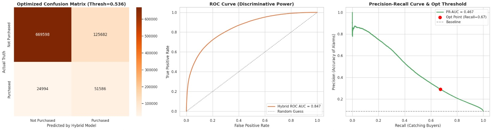

# Intent Prediction — Nexora

A real-time **purchase intent prediction system** built for e-commerce. It watches how a user browses (view sequences, price ranges, time patterns) and predicts — live — whether they're likely to buy.

---

## How It Works

User browsing behavior is captured on the frontend as a series of snapshots. These snapshots are sent to the backend, where:

1. A **GRU model** extracts sequential embeddings from price/time sequences (up to 15 steps)
2. An **XGBoost classifier** combines those embeddings with 11 tabular behavioral features
3. A purchase intent probability is returned in real time and shown as a discount notification if the user is likely to bounce

---

## Project Structure

```
Intent Prediction/
├── E-Commere-Frontend/       # React + Vite storefront (Nexora)
│   └── src/
│       ├── hooks/            # useSnapshots, useTracker, useCart
│       ├── lib/              # tracker.js (event capture), api.js (backend calls)
│       └── components/       # ProductCard, CartSidebar, DiscountNotification, etc.
│
├── Production_Standard/      # FastAPI inference backend + trained models
│   ├── backend_app.py        # /predict endpoint
│   ├── gru_embedding_extractor.keras   # Trained GRU model
│   ├── hybrid_xgb.json       # Trained XGBoost model
│   ├── GRUs_Actual.ipynb     # GRU training notebook
│   ├── Adding_new_features.ipynb       # Feature engineering
│   └── requirements.txt
│
└── live_tracking.csv         # Live prediction logs (auto-generated)
```

---

## Model Results

> Image file: `Production_Standard/Hybrid_results.jpeg`



---

## Backend — `/predict` Endpoint

**POST** `http://localhost:8000/predict`

```json
{
  "tabular_features": {
    "total_views_so_far": 5,
    "unique_cat1_seen": 2,
    "avg_price_seen": 1200.0,
    "brand_switches": 1,
    "duration_so_far_seconds": 90,
    "live_focus_ratio": 0.6,
    "budget_exploration_so_far": 0.4,
    "rolling_views_per_minute": 3.2,
    "idle_time_seconds": 12,
    "category_scatter_ratio": 0.3,
    "unknown_cat_ratio": 0.1,
    "session_id": "abc123",
    "snapshot_time": 90
  },
  "gru_sequence": [[1200.0, 30.0], [0.0, 0.0], ...]
}
```

**Response:**
```json
{
  "success": true,
  "probability": 0.72,
  "prediction": 1
}
```

---

## Running Locally

**Backend:**
```bash
cd Production_Standard
pip install -r requirements.txt
python backend_app.py
# Runs on http://localhost:8000
```

**Frontend:**
```bash
cd E-Commere-Frontend
npm install
npm run dev
# Runs on http://localhost:5173
```

---

## Tech Stack

| Layer | Tech |
|---|---|
| Frontend | React, Vite, Vanilla CSS |
| Backend | FastAPI, Uvicorn |
| ML Models | TensorFlow/Keras (GRU), XGBoost |
| Logging | CSV (live_tracking.csv) |

---

## Features

- Snapshot-based behavioral tracking (every 30s)
- GRU sequence embeddings (price + time-gap)
- Hybrid model inference (GRU + XGBoost)
- Real-time discount popup for high-intent users
- Async prediction logging
